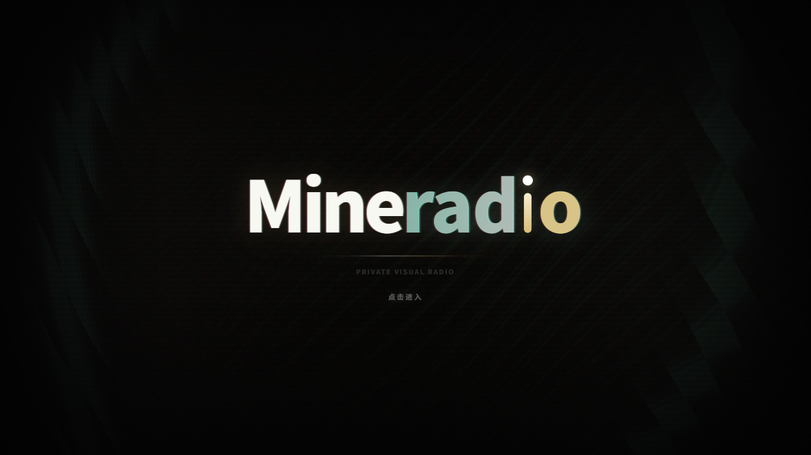

# Mineradio-Next



Mineradio-Next 是一款基于 [Mineradio](https://github.com/XxHuberrr/Mineradio) 二次开发的跨平台桌面沉浸式音乐播放器，从 Electron 迁移至 **Tauri v2 + Rust** 架构，在保留原版天气电台、搜索播放、歌词舞台、粒子视觉和 3D 歌单架等核心体验的同时，带来更快的启动速度和更低的内存占用。

> **关于原项目**：Mineradio 由 XxHuberrr 设计与打造，采用 GPL-3.0 协议开源。Mineradio-Next 在此优秀基础上进行架构迁移和功能演进，向原作者致以诚挚的敬意和感谢。

## 下载

| 平台 | 安装包 | 下载 |
| --- | --- | --- |
| Windows (x64) | NSIS 安装程序 | [Mineradio-Next_1.1.3_x64-setup.exe](https://github.com/zhanghaifei1997/Mineradio-Next/releases/download/v1.1.3/Mineradio-Next_1.1.3_x64-setup.exe) |
| Windows (x64) | MSI 安装包 | [Mineradio-Next_1.1.3_x64_en-US.msi](https://github.com/zhanghaifei1997/Mineradio-Next/releases/download/v1.1.3/Mineradio-Next_1.1.3_x64_en-US.msi) |
| macOS (Apple Silicon) | DMG | [Mineradio-Next_1.1.3_aarch64.dmg](https://github.com/zhanghaifei1997/Mineradio-Next/releases/download/v1.1.3/Mineradio-Next_1.1.3_aarch64.dmg) |

更多版本见 [GitHub Releases](https://github.com/zhanghaifei1997/Mineradio-Next/releases)。

安装时只需要下载并运行安装包。不要下载 `Source code`、`.blockmap`、`latest.yml`。

## 下载或安装被拦截怎么办

小众桌面软件、未签名安装包有时会被浏览器、Windows Defender 或 SmartScreen 提示风险。请先确认安装包来自上面的 GitHub Release 官方入口。

1. 浏览器下载栏提示风险时，打开下载列表，点这条下载右侧的 `...` 三个点，选择 `保留` / `仍要保留` / `显示更多` 后继续保留。
2. Windows SmartScreen 弹出蓝色拦截窗口时，点 `更多信息`，再点 `仍要运行`。
3. 如果杀毒软件明确显示木马、高危或已经隔离，不要强行运行；删除该文件后重新从 GitHub Release 下载，仍然异常请带截图反馈给作者。

## 当前版本

当前版本：`1.1.3`

## 核心特性

- **Tauri v2 + Rust 架构**：启动更快，内存占用更低，原生跨平台支持（Windows / macOS）
- Open-Meteo 天气电台，根据当前位置、城市和天气 mood 生成更合适的播放队列
- 首页包含天气电台、每日推荐、私人电台、继续听、听歌画像和我的歌单入口
- Wallpaper 银河首页背景，未播放状态保持干净的星河氛围
- 播放后切换到 Emily / 默认播放态视觉，歌词舞台与粒子舞台同步工作
- 基于节奏的电影镜头视觉系统
- 面向长播客和 DJ 曲目的专属视觉模式
- 点云预设系统，支持多种 3D 点云可视化效果
- 歌词舞台、自定义歌词、歌词位置与视觉控制
- 自定义专辑封面上传与裁剪
- 右键唤起 3D 歌单架，支持歌单队列浏览
- 网易云音乐账号、搜索、歌单、播客等体验接入
- QQ 音乐搜索、登录态与音源补充接入
- GitHub Releases 更新检测与下载入口
- 首次启动内置「默认测试」视觉用户存档，软件内默认视觉参数与该存档一致

## 使用说明

Windows / macOS 用户可以在 GitHub Releases 中下载安装包。

已经安装过旧版本的用户，建议卸载旧版本后再使用新版安装包安装。

## 开发运行

```bash
# 安装前端依赖
npm install

# 安装 Rust 依赖并启动 Tauri 开发模式
cargo tauri dev

# 构建 Windows 安装包
cargo tauri build

# 构建 macOS 安装包
cargo tauri build -- --bundles dmg
```

前端主逻辑在 `public/index.html`，后端 Rust 代码在 `src-tauri/src/`。Tauri 开发模式下前端改动会自动刷新，Rust 后端改动需要重新编译。

## 技术架构

Mineradio-Next 相比原版 Mineradio 的主要架构变化：

- **前端**：保留原有 HTML/JS/CSS 前端，通过 Tauri WebView 加载
- **后端**：Rust 实现网易云 API 加密通信、HTTP server（Actix-web）、IPC 命令
- **桌面集成**：Tauri v2 替代 Electron，提供窗口管理、系统托盘、全局快捷键、单实例等能力
- **兼容性**：保留 `server.js` 和 `desktop/` 作为 Electron 兼容层，方便对比和回退

## 更新机制

Mineradio-Next 会请求 GitHub Releases latest 检测新版本。远端版本高于本地版本时，应用内更新入口会展示 Release 内容、下载安装包到本机用户数据目录，并通过系统打开安装包。

## 第三方音乐平台说明

Mineradio-Next 不是网易云音乐、QQ 音乐或腾讯音乐娱乐集团的官方客户端，也不隶属于任何音乐平台。

项目中的第三方平台接入仅用于个人学习、本地客户端体验和用户自有账号的播放辅助。请遵守对应平台的用户协议、版权规则和会员权益规则。项目不会提供绕过付费、绕过会员、破解音质或重新分发音乐内容的能力。

## 用户数据与隐私

登录 Cookie、搜索历史、自定义封面、自定义歌词、节奏分析缓存等数据只应保存在本机用户数据目录或浏览器本地存储中，不应提交到仓库。

更多说明见 [PRIVACY.md](./PRIVACY.md)。

## 致谢

### 原作者

Mineradio 由 **XxHuberrr** 主要设计与打造，是本项目的基础和灵感来源。emily 作为早期视觉底层想法与 `emily` 视觉预设改进方向的共创者和灵感来源之一，特此感谢。

同时感谢小天才e宝、应春日、锋将军、軌跡、林中、骊、风痕、花椰菜🥦在早期体验、测试反馈和发布准备中的帮助。

### 二次开发

Mineradio-Next 由 **zhanghaifei1997** 维护，主要进行 Tauri + Rust 架构迁移和功能扩展。

## 版权与授权

Mineradio 原始项目：Copyright (C) 2026 XxHuberrr. GPL-3.0 License.

Mineradio-Next 二次开发：Copyright (C) 2026 zhanghaifei1997. 同样遵循 GPL-3.0 License.

详见 [LICENSE](./LICENSE) 和 [NOTICE.md](./NOTICE.md)。

Mineradio 名称、MR Logo、界面视觉设计与原创视觉表达归原作者 XxHuberrr 所有；二次开发新增部分归 zhanghaifei1997 所有。第三方依赖和第三方服务分别遵循其各自授权与服务条款。
